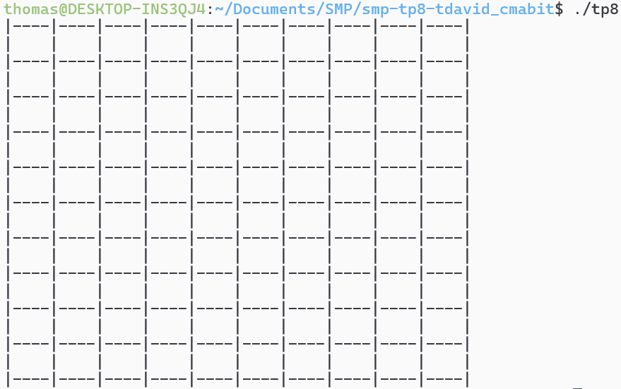

# SMP-TP8 : Jeu de la vie

`Thomas David - Charles Mabit`

## Introduction

Dans ce tp, nous allons coder un **"mini jeu de la vie"** dans lequel des animaux vont se manger entre eux en se déplaçant sur les cases d'un tableau. Deux animaux qui se rencontrent s'attaquerons en jouant au  **Pierre-Feuille-Ciseaux** pour savoir lequel mangera l'autre. Chaque type d'animal a sa propre méthode de déplacement.

Ce tp nous fera mobiliser nos connaissances en diagramme UML et en Programmation Orientée Objet (POO).

## Partie 1 : Tableau vide

Avant d'ajouter les animaux dans le tableau, nous avons préféré concevoir ce dernier pour prévoir le comportement à adopter en fonction des déplacements de animaux.

Ainsi, nous sommes en mesure d'ajouter progressivement les différentes fonctions au fur et à mesure que nous avançons sur le développement du code.  

Nous obtenons alors ce résultat :

>

## Partie 2 : Les animaux

Pour les animaux, nous créons un fichier d'include pour chaque classe (Lion, Ours, Loup, Pierre).

On commence donc par une classe globale **Animal** dont tout les animaux vont hériter :

- Pierre : Ne se déplace pas et attaque uniquement avec des **Pierres**.
- Lion : Se déplace uniquement sur les quatres diagonales avec 1 case de distance. Attaquent avec **Feuille** ou **Ciseaux**.
- Loup : Se déplace n'importe où sur le tableau sans limite de distance et utilise aléatoirement **toutes les attaquent possibles**.
- Ours : Utilise les déplacements du cavalier aux échecs. Attaquent uniquement avec la **feuille**.

Les animaux qui sortent de la carte d'un côté passent automatiquement de l'autre côté du tableau.
